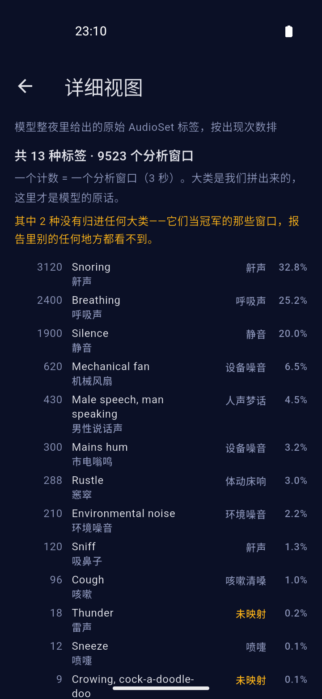

<div align="center">

# 睡眠录音分析

整夜录音，在手机本地把声音分成鼾声、呼吸、咳嗽、梦话等类别，早上给出时间线和统计。

**默认音频不出设备。** 没有账号、没有服务器——装完就能用，分析全在手机上。

唯一的例外是**你自己**去「导出数据」页配上坚果云 / WebDAV：那之后每晚录完会传到**你自己名下**的网盘。这个项目没有自己的服务器，也不会有。

<a href="https://github.com/14790897/sleep-secret/actions/workflows/ci.yml"></a> <a href="https://github.com/14790897/sleep-secret/releases"></a> <a href="LICENSE"></a>

**文档站**：<https://mygithub.sixiangjia.de/sleep-secret/>（[使用指南](https://mygithub.sixiangjia.de/sleep-secret/guide/) · [看懂报告](https://mygithub.sixiangjia.de/sleep-secret/report/) · [数据与隐私](https://mygithub.sixiangjia.de/sleep-secret/privacy/)）

    

</div>

## 装到手机上

到 [Releases](https://github.com/14790897/sleep-secret/releases) 下载最新一版的
`app-arm64-v8a-release.apk`（绝大多数手机是这个架构），直接安装。没有上架任何应用商店，
所以需要允许「安装未知来源应用」。

第一次打开要授予**录音**和**通知**权限；小米、华为这类系统还要把省电策略改成
「无限制」、允许自启动、在最近任务里锁定应用——不设的话整夜录音可能被系统清掉，
早上只会得到一份空报告。

## 它做什么

睡前点一下开始，第二天早上再点一下结束，然后得到一份报告：

- **整夜声音时间线** —— 什么时候有声音、是什么声音、持续多久
- **鼾声指数** —— 鼾声时长占分析时长的百分比，用来跨夜比较
- **类别分布与每小时分布** —— 哪几个小时动静最大
- **事件明细** —— 每个事件的时间、类别、置信度，鼾声还能点开试听

识别得到的九大类：**鼾声 / 呼吸声 / 咳嗽清嗓 / 喷嚏 / 人声梦话 / 体动床响 / 环境噪音 / 设备噪音 / 静音**。

三件刻意做的事：

- **录音时看得见电平**。电平条上画了识别阈值线，麦克风有没有在工作、音量够不够，一眼就能看出来——这是排查"整夜录到静音"最直接的手段。
- **不做后处理门控**。录到的每一段都送进模型，取给分最高的那一类。直觉上该加一道"分数不够就别报"的闸门，
  但实测**它什么也不做**——雨声、公鸡叫、真实鼾声、白噪声四份素材上拦截数都是 0，连真实房间底噪都被稳定认成
  「环境噪音」，而那个归类本来就是对的。模型是端到端的打标器，在它后面加阈值需要有真实音频作为依据。
  把握程度改为**在事件列表里直接标出来**：0.93 的鼾声和 0.21 的鼾声不再长得一样。
- **能量门控默认关闭**。它唯一的作用是跳过安静段省算力，实测并没在挡误报（挡误报的是模型自己）。
  一道阈值 + 自适应估计 + 上下界换来的只是"整夜 8 小时里约 11 分钟 CPU"，而那个账是按 PC 速度估的——
  真机没量过，所以先关掉。「关于」页有开关（「安静段跳过」），**门槛能在 30–60 分贝之间调**。
  ⚠️ 调的时候别只看数字：手机放得远、隔着被子时，真实鼾声可能比默认门槛还轻——
  先看录音页那条红线够不够得到，再决定整夜用不用它。
- **只留事件时间点，不留原始音频**。整夜 16kHz 单声道约 920MB，全存不现实。鼾声片段可以选留——默认开，**整段保留**（不是截一段），约每分钟 1.9MB，存在应用私有目录，卸载即清。

## 它不做什么

- **不是医疗器械**，不能用于诊断睡眠呼吸暂停或其他疾病
- **不做睡眠分期**（深睡/浅睡/REM）——那需要体动或心率，纯音频做不到。这里的"睡眠声音评分"只反映**声音吵不吵**，不是睡眠质量
- **没针对你本人校准过**。用的是通用音频事件模型，个体差异会让检出率不一样

## 工作原理

```
麦克风 ──> 16kHz PCM ──> CED-tiny 推理 ──> 事件合并 ──> 报告
                          (端侧)          (取 argmax)
```

模型是 [CED-tiny](https://huggingface.co/mispeech/ced-tiny)（5.5M 参数，AudioSet 预训练），
转成 ONNX 后用 ONNX Runtime 在设备上推理。AudioSet 有 527 个类别，其中 **47 个**
按语义归并成上面那九大类——没归进大类的那些标签不会消失，报告里的
「详细视图」会把它们原样列出来（那正是发现映射错误的地方）。

选 CED-tiny 而不是原始论文里的 AST：AST 是 86M 参数，在手机上跑整夜不现实；
CED-tiny 小一个数量级，整夜跑得动。

## 技术栈

| | |
|---|---|
| 应用 | Flutter 3.47.6 / Dart |
| 推理 | ONNX Runtime（`flutter_onnxruntime`） |
| 录音 | `record` 插件，16kHz 单声道 PCM |
| 保活 | `flutter_foreground_task`，麦克风型前台服务 |
| 存储 | `sqflite`（只存分析结果） |
| 播放 | `just_audio`（事件片段试听） |

架构分三层：UI（MVVM + ChangeNotifier）/ Data（Services + Repositories）/ Domain。
领域层不依赖 Flutter，分析引擎可以脱离界面单独测。

## 开发

### 环境

- Flutter 3.47.6（stable）
- JDK 17
- Android SDK（compileSdk 跟随 Flutter）

### 跑起来

```bash
cd app
flutter pub get
flutter run -d <设备>
```

### 测试

```bash
cd app
flutter analyze
flutter test                                    # 495 个单元测试
flutter test integration_test/all_tests.dart -d <设备>   # 28 个集成测试
```

**集成测试为什么走聚合入口**：`flutter test integration_test`（目录形式）会为每个
测试文件单独构建并安装一次 APK。5 个文件就是 5 轮「构建 → 安装 → 启动 → 卸载」，
实测在 GitHub 托管的模拟器上第 2 轮就把模拟器搞挂了，job 拖到 13 分钟以上。
`all_tests.dart` 是个只做转发的聚合入口，一次构建、一次安装、一次启动，
本地跑完 28 个测试只要 63 秒（实测：Android 模拟器；Windows 桌面 40 秒）。

**需要真实麦克风的测试不在 CI 里**，它们放在 `app/integration_test_hardware/`：

```bash
flutter test integration_test_hardware/real_recorder_flow_test.dart -d <设备>
flutter test integration_test_hardware/microphone_diagnostic_test.dart -d <设备>
```

CI 上的音频全部来自 assets 里的**真实录音回放**（`WavReplayAudioCapture` 注入到
`AudioCapture` 接口上）——不依赖硬件、不联网、时序确定。被换掉的只有
`RecordAudioCapture` 那一层调用 `record` 插件的胶水，它之上的一切都是真代码。

### 端侧模型

模型文件在 `app/assets/models/ced-tiny.onnx`。`ml/` 下是 PC 端的参考实现和
类别映射表，用来核对端侧结果——**两端跑同一个模型，结果应当一致**。

```bash
cd ml
python infer.py     # 跑一段合成的整夜音频，验证整条链路
```

### 文档站

`docs/` 一个目录担两件事：README 用的截图（`docs/screenshots/`）和文档站的源。
配置在 `mkdocs.yml`，用 mkdocs-material + mkdocs-static-i18n 做中英双语，
推到 main 后由 `.github/workflows/docs.yml` 发布。

```bash
pip install mkdocs-material mkdocs-static-i18n
mkdocs build --strict     # 本地验证（CI 跑的就是这条）
mkdocs serve              # 本地预览
```

> ⚠️ 英文页面**必须和中文页面逐一成对**：`docs/en/` 缺了对应文件时，
> 英文站点会在同样的路径下**静默渲染中文内容**——构建不报错，`--strict` 也不失败。
> 写完用下面这条对一下，输出为空才算齐：

```bash
diff <(cd docs && find . -name '*.md' -not -path './en/*' | sort) \
     <(cd docs/en && find . -name '*.md' | sort)
```

## 发版

用 [semantic-release](https://semantic-release.gitbook.io/) 自动化：推到 `main`
之后按提交信息定版本、生成 release notes、构建产物，挂到 GitHub Release 上。

### Release 里有什么

| 产物 | 大小 | 说明 |
|---|---|---|
| `app-arm64-v8a-release.apk` | ~53MB | **现代手机装这个** |
| `app-armeabi-v7a-release.apk` | ~43MB | 较老的 32 位设备 |
| `app-x86_64-release.apk` | ~60MB | 模拟器 |
| `sleep-secret-windows-<版本>.zip` | ~30MB | **测试用途**，见下 |

APK **按 ABI 分包**而不是打一个通用包：通用包约 140MB，分包后每个约 50MB。
代价是要选对架构——不确定的话，`arm64-v8a` 覆盖绝大多数现代手机。

⚠️ **Windows 包是开发/测试用途。** 整夜录音**可以**用，条件只有一个：**插着电**。

Windows 上不需要 Android 那种前台服务——它防的是系统杀后台，而 Windows 不杀
正在运行的应用。唯一的风险是**系统休眠**：插电时大多数机器默认就不休眠
（实测开发机是「交流 0 秒 = 永不」），但不保证，必要时把电源计划设成「从不休眠」。
**关掉屏幕不影响录音。**

（早先这里写着「不适合整夜录音」——那是把 Android 的机制套到了 Windows 上，
推断错了。）

Windows 产物由单独一个 job 构建（Flutter 的桌面版没法在 Linux 上交叉编译），
排在发版之后并认准刚创建的 tag——这样包里的版本号才对得上。

```
fix:              → patch（1.0.1 → 1.0.2）
feat:             → minor（1.0.1 → 1.1.0）
BREAKING CHANGE:  → major
chore:/docs:/ci:  → 不发版
```

> ⚠️ 提交信息不遵守这个约定时，流水线**不会报错，只是静默地什么都不做**。

CI 有四个 job：静态分析 + 单元测试、Android 模拟器上的集成测试、Windows 桌面版的
集成测试（桌面这条路径和 Android 有几处实质不同，只构建不跑就验证不到），
以及 release 构建。跑在 `ubuntu-latest` 上，只有 Windows 那个是 `windows-latest`。

### ⚠️ 签名密钥

`app/android/sleep-secret-release.jks` 和同目录的 `key.properties` 是**这个应用的身份**。

**弄丢它们就再也无法给已经装过的人推送更新**——只能让所有人卸载重装，
而那会清掉全部睡眠历史。两个文件都已 gitignore，本地留一份，GitHub Secrets 里存一份备份。

换密钥等于换应用身份，代价同上。真要换，记得同步更新
`.github/workflows/release.yml` 里的 `EXPECTED_CERT_SHA256`——
发版流程会拿它校验证书指纹，**签名不符就让发版失败**，
免得发出一个用户装不上的包。

## 实测

真实使用中量到的数字。**每条都带设备和条件**——没有条件的数字没法比较：

| 项目 | 数字 | 条件 |
|---|---|---|
| **整夜耗电** | **6.5 小时 9%** | 2026-10-07 夜，Redmi K80，息屏整夜录音，默认设置（能量门控关着） |

按这个比例，十小时约 14%——**一晚的电量代价可以接受，不用插电**。
它同时验证了前台服务能撑过整夜不被杀（下面「还没验证的事」里原来排第一条的那件事）。

⚠️ 它**答不了**「推理占了多少」：9% 里混着麦克风、CPU 和息屏待机。
所以「能量门控该不该开、该不该删」这个问题，这个数**回答不了**——
它只证明**不改也活得下来**。

⚠️ 一台机器、一个晚上。换 ROM、换机型、开不开片段保留，都可能不一样。

## 还没验证的事

写在这里，免得把它们当成"已经验证过"：

- **整夜保活（多机型）**。已经量到一晚：6.5 小时耗电 9%，前台服务没被杀（见「实测」）。
  但那只是一台小米、一个晚上——换台机器、换个 ROM 结论就可能不一样。
  小米/华为这类 ROM 仍然需要用户手动设置：把省电策略改成「无限制」、允许自启动、
  在最近任务里锁定应用。
- **真实鼾声的检出率**。模型对测试素材里那些**干净的近场录音**很确定
  （核心鼾声得分 0.82~0.97，对照组雨声/鸡叫是 0.000）。但那些是近场——
  手机放在枕边、隔着被子录到的鼾声是什么样，还没有数据。
  （`bandlimited_snore.wav` 是往这个方向造的：削掉 320Hz 以下、压上噪声，
  模拟"手机没放枕边"，它还能拿到 0.87。但那只是**模拟**，不是真机数据。）

## 许可

**GPL-3.0-or-later**，全文见 [LICENSE](LICENSE)。

采用 GPL 而不是更宽松的许可，是因为这个 App 的主张就是「音频不出设备」——
而那句话只有**代码可查**的时候才可信。GPL 保证任何人拿到的版本都能被
审阅、也能被继续改进；换成闭源分支就没法验证了。

## 第三方素材

见 [THIRD_PARTY_NOTICES.md](THIRD_PARTY_NOTICES.md)。测试音频已全部换成
**CC0（公共领域）**的真实录音，模型是 **Apache-2.0**，都没有商用限制。
