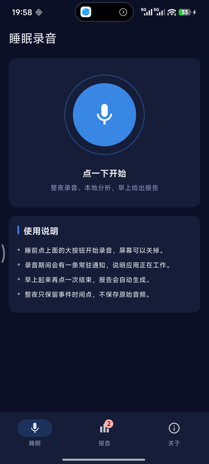
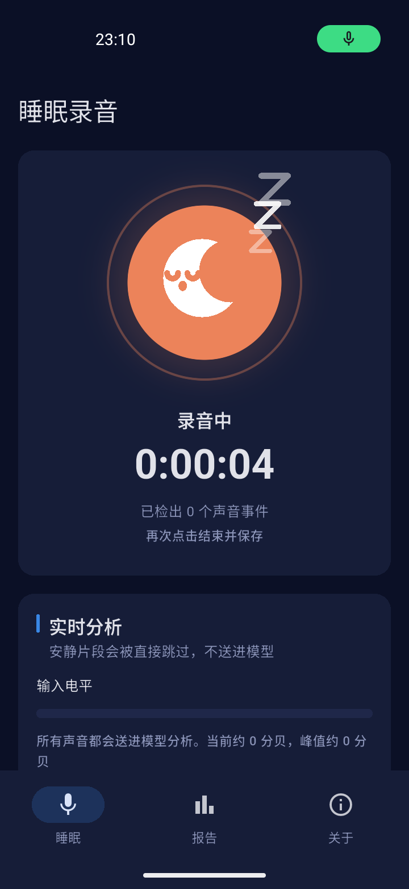
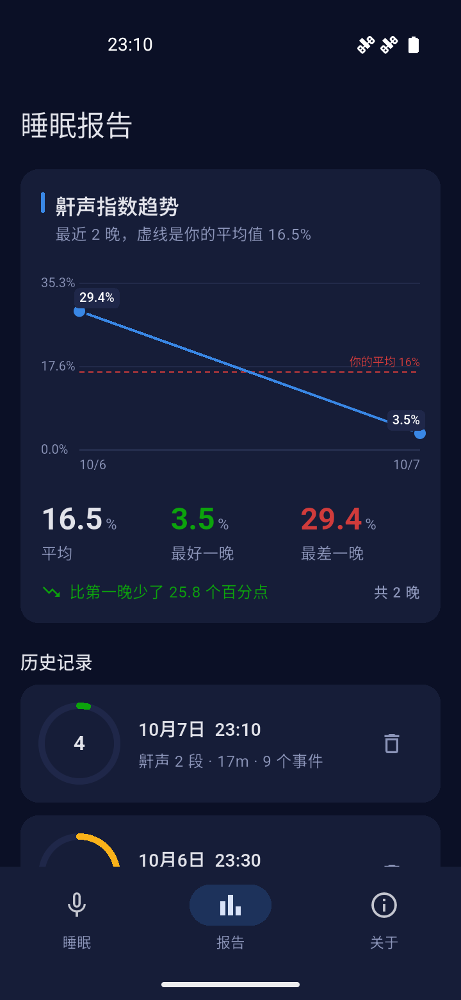
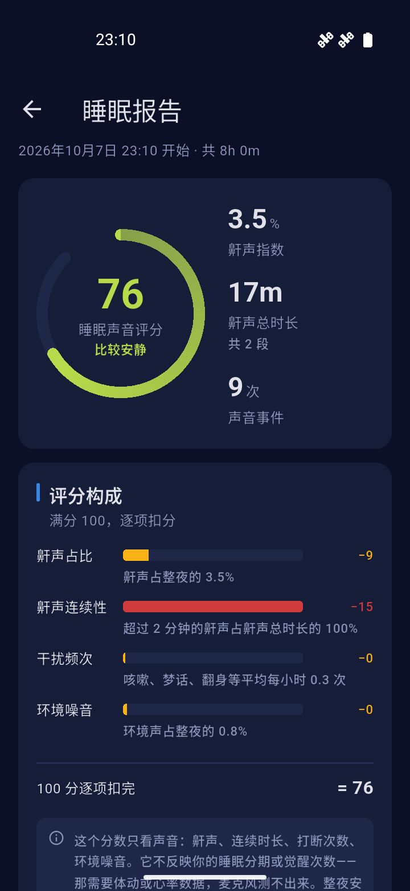

<div align="center">

# 睡眠录音分析

整夜录音，在手机本地把声音分成鼾声、呼吸、咳嗽、梦话等类别，早上给出时间线和统计。

**音频不出设备。** 没有账号、没有上传、没有云端。

   

</div>

## 它做什么

睡前点一下开始，第二天早上再点一下结束，然后得到一份报告：

- **整夜声音时间线** —— 什么时候有声音、是什么声音、持续多久
- **鼾声指数** —— 鼾声时长占分析时长的百分比，用来跨夜比较
- **类别分布与每小时分布** —— 哪几个小时动静最大
- **事件明细** —— 每个事件的时间、类别、置信度，鼾声还能点开试听

识别得到的七大类：**鼾声 / 呼吸声 / 咳嗽清嗓 / 人声梦话 / 体动床响 / 环境噪音 / 静音**。

三件刻意做的事：

- **录音时看得见电平**。电平条上画了识别阈值线，麦克风有没有在工作、音量够不够，一眼就能看出来——这是排查"整夜录到静音"最直接的手段。
- **不做后处理门控**。录到的每一段都送进模型，取给分最高的那一类。直觉上该加一道"分数不够就别报"的闸门，
  但实测**它什么也不做**——雨声、公鸡叫、真实鼾声、白噪声四份素材上拦截数都是 0，连真实房间底噪都被稳定认成
  「环境噪音」，而那个归类本来就是对的。模型是端到端的打标器，在它后面加阈值需要有真实音频作为依据。
  把握程度改为**在事件列表里直接标出来**：0.93 的鼾声和 0.21 的鼾声不再长得一样。
- **能量门控默认关闭**。它唯一的作用是跳过安静段省算力，实测并没在挡误报（挡误报的是模型自己）。
  一道阈值 + 自适应估计 + 上下界换来的只是"整夜 8 小时里约 11 分钟 CPU"，而那个账是按 PC 速度估的——
  真机没量过，所以先关掉，`AnalysisConfig.vadEnabled` 可以打开。
- **只留事件时间点，不留原始音频**。整夜 16kHz 单声道约 920MB，全存不现实。鼾声片段可以选留（默认开，存在应用私有目录，卸载即清）。

## 它不做什么

- **不是医疗器械**，不能用于诊断睡眠呼吸暂停或其他疾病
- **不做睡眠分期**（深睡/浅睡/REM）——那需要体动或心率，纯音频做不到。这里的"睡眠声音评分"只反映**声音吵不吵**，不是睡眠质量
- **没针对你本人校准过**。用的是通用音频事件模型，个体差异会让检出率不一样

## 工作原理

```
麦克风 ──> 16kHz PCM ──> CED-tiny 推理 ──> 事件合并 ──> 报告
                          (端侧)          (取 argmax)
```

模型是 [CED-tiny](https://huggingface.co/mispeech/ced-tiny)（5.5M 参数，AudioSet 预训练），
转成 ONNX 后用 ONNX Runtime 在设备上推理。AudioSet 的 527 个类别按语义归并成上面那七大类。

选 CED-tiny 而不是原始论文里的 AST：AST 是 86M 参数，在手机上跑整夜不现实；
CED-tiny 小一个数量级，整夜跑得动。

## 技术栈

| | |
|---|---|
| 应用 | Flutter 3.47.6 / Dart |
| 推理 | ONNX Runtime（`flutter_onnxruntime`） |
| 录音 | `record` 插件，16kHz 单声道 PCM |
| 保活 | `flutter_foreground_task`，麦克风型前台服务 |
| 存储 | `sqflite`（只存分析结果） |
| 播放 | `just_audio`（事件片段试听） |

架构分三层：UI（MVVM + ChangeNotifier）/ Data（Services + Repositories）/ Domain。
领域层不依赖 Flutter，分析引擎可以脱离界面单独测。

## 开发

### 环境

- Flutter 3.47.6（stable）
- JDK 17
- Android SDK（compileSdk 跟随 Flutter）

### 跑起来

```bash
cd app
flutter pub get
flutter run -d <设备>
```

### 测试

```bash
cd app
flutter analyze
flutter test                                    # 248 个单元测试
flutter test integration_test/all_tests.dart -d <设备>   # 24 个集成测试
```

**集成测试为什么走聚合入口**：`flutter test integration_test`（目录形式）会为每个
测试文件单独构建并安装一次 APK。5 个文件就是 5 轮「构建 → 安装 → 启动 → 卸载」，
实测在 GitHub 托管的模拟器上第 2 轮就把模拟器搞挂了，job 拖到 13 分钟以上。
`all_tests.dart` 是个只做转发的聚合入口，一次构建、一次安装、一次启动，
本地跑完 24 个测试只要 44 秒。

**需要真实麦克风的测试不在 CI 里**，它们放在 `app/integration_test_hardware/`：

```bash
flutter test integration_test_hardware/real_recorder_flow_test.dart -d <设备>
flutter test integration_test_hardware/microphone_diagnostic_test.dart -d <设备>
```

CI 上的音频全部来自 assets 里的**真实录音回放**（`WavReplayAudioCapture` 注入到
`AudioCapture` 接口上）——不依赖硬件、不联网、时序确定。被换掉的只有
`RecordAudioCapture` 那一层调用 `record` 插件的胶水，它之上的一切都是真代码。

### 端侧模型

模型文件在 `app/assets/models/ced-tiny.onnx`。`ml/` 下是 PC 端的参考实现和
类别映射表，用来核对端侧结果——**两端跑同一个模型，结果应当一致**。

```bash
cd ml
python infer.py     # 跑一段合成的整夜音频，验证整条链路
```

## 发版

用 [semantic-release](https://semantic-release.gitbook.io/) 自动化：推到 `main`
之后按提交信息定版本、生成 release notes、构建 release APK，挂到 GitHub Release 上。

```
fix:              → patch（1.0.1 → 1.0.2）
feat:             → minor（1.0.1 → 1.1.0）
BREAKING CHANGE:  → major
chore:/docs:/ci:  → 不发版
```

> ⚠️ 提交信息不遵守这个约定时，流水线**不会报错，只是静默地什么都不做**。

CI 有三个 job（静态分析 + 单元测试、Android 模拟器上的集成测试、release 构建），
跑在 `ubuntu-latest` 上。

### ⚠️ 签名密钥

`app/android/sleep-secret-release.jks` 和同目录的 `key.properties` 是**这个应用的身份**。

**弄丢它们就再也无法给已经装过的人推送更新**——只能让所有人卸载重装，
而那会清掉全部睡眠历史。两个文件都已 gitignore，本地留一份，GitHub Secrets 里存一份备份。

换密钥等于换应用身份，代价同上。真要换，记得同步更新
`.github/workflows/release.yml` 里的 `EXPECTED_CERT_SHA256`——
发版流程会拿它校验证书指纹，**签名不符就让发版失败**，
免得发出一个用户装不上的包。

## 还没验证的事

写在这里，免得把它们当成"已经验证过"：

- **整夜保活**。前台服务能不能撑过 8 小时、息屏后会不会被杀、国产 ROM 会不会清理后台
  ——这些只有真的睡一晚才知道。小米/华为这类 ROM 还需要用户手动把省电策略改成
  「无限制」、允许自启动、在最近任务里锁定应用。
- **真实鼾声的检出率**。模型对 ESC-50 里的典型鼾声很确定（得分 0.93+），
  但那是干净的近场录音。手机放在枕边、隔着被子录到的鼾声是什么样，还没有数据。

## 第三方素材

见 [THIRD_PARTY_NOTICES.md](THIRD_PARTY_NOTICES.md)。其中 **ESC-50 音频是 CC BY-NC
（禁止商用）**，只用于测试验证——要商业化的话必须先移除或替换掉。
