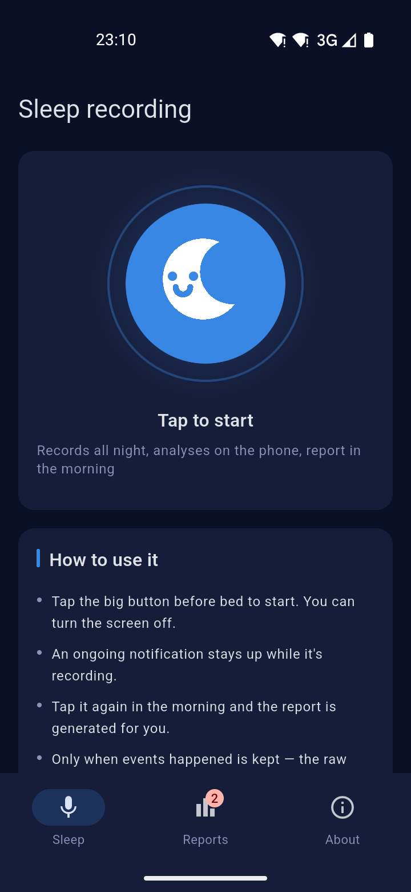
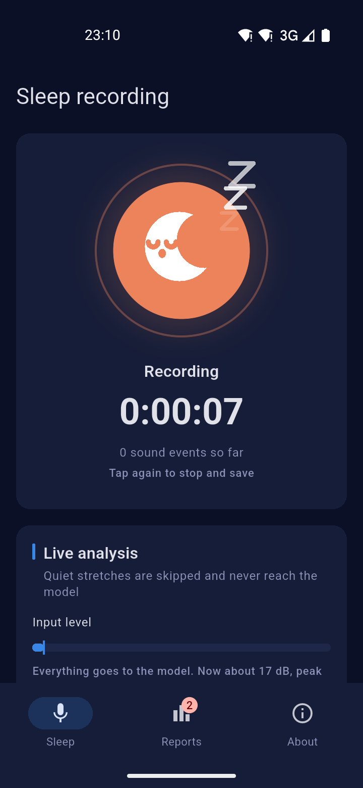
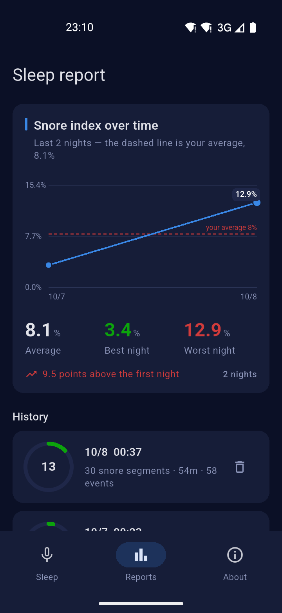
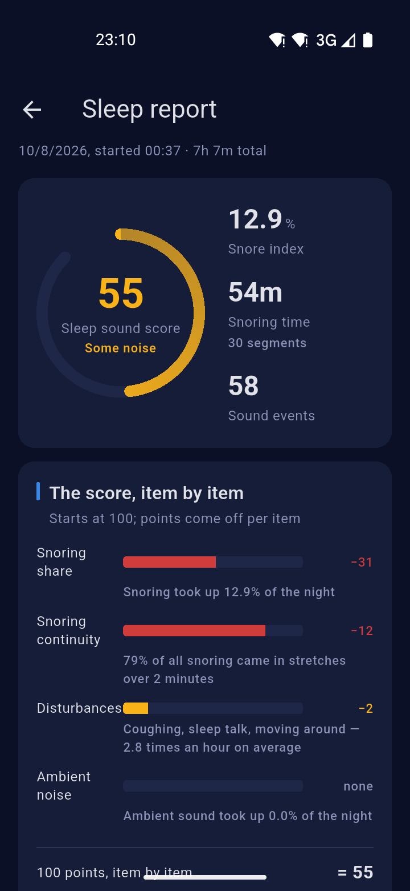
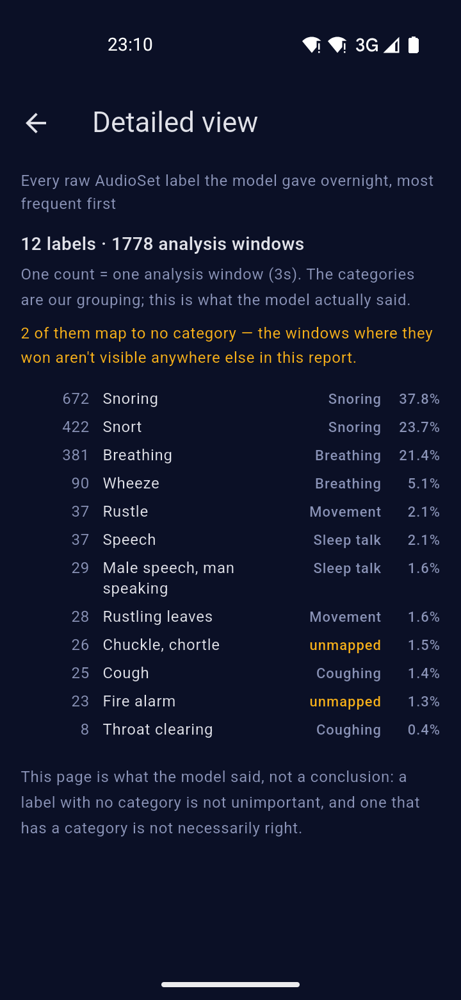

# Sleep Secret

Records all night, classifies the sounds of sleep on the phone itself, and gives you
a report in the morning: when there was sound, what it was, and how long it lasted.

## Three things worth knowing

- **Audio stays on the device by default.** No account, no server, works offline.
  The one exception is Nutstore / WebDAV export, which you configure yourself —
  and it uploads to *your own* cloud storage.
- **Inference runs on the device.** The model is CED-tiny (5.5M parameters,
  AudioSet-pretrained), converted to ONNX and run locally. No network needed.
- **It only reports sounds the model actually recognised.** It does not infer
  "breathing stopped for a moment" from timing — a microphone cannot tell
  "breathing stopped" from "breathing too quiet to record". Telling those apart
  needs oxygen saturation and airflow.

## What it isn't

!!! warning "Not a medical device"

    It cannot be used to diagnose sleep apnoea or any other condition. The results
    come from a general-purpose audio event model that has never been calibrated
    to you. If you feel unwell, see a doctor.

- **No sleep staging** (deep / light / REM). That needs movement or heart rate,
  which audio alone cannot provide. The "Sleep sound score" measures **how noisy
  the night was**, not how well you slept.
- **The full night's audio is not kept.** Eight hours of 16 kHz mono is roughly
  920 MB. What is kept is the timing and category of each event, plus the snore
  clips you choose to keep.

## Android and Windows only

Android is the main target. A Windows build exists and does run, but it is
**for testing only** — desktop has no equivalent of Android's foreground service,
so overnight recording requires mains power and a machine that does not sleep.

There is no iOS version.

## Start here

| Page | What's in it |
|---|---|
| [Guide](guide.md) | Which APK, what to set up on first launch, how a night goes |
| [Reading the report](report.md) | What each number means, and what it doesn't |
| [Data & privacy](privacy.md) | What is stored, what leaves the device, what the permissions are for |
| [FAQ](faq.md) | No report in the morning, battery, apnoea detection |
